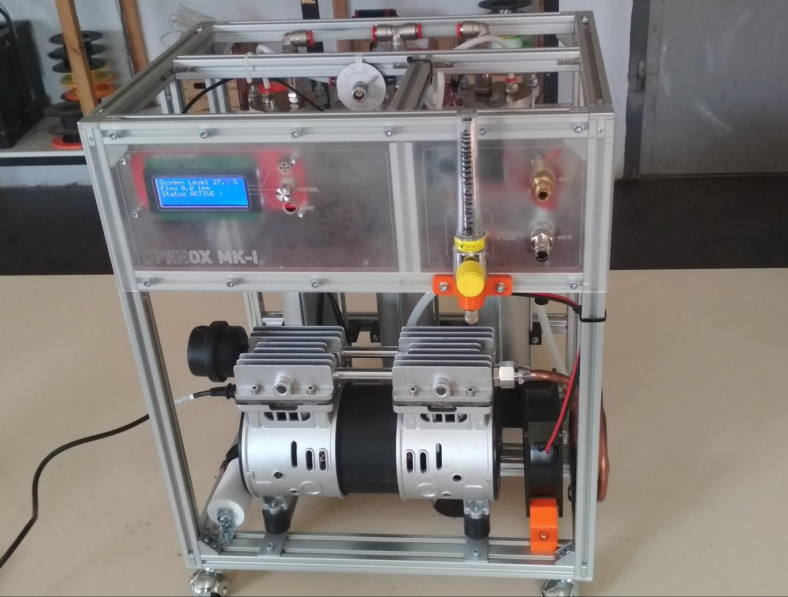

OPENOX MK-I
===========

**Open Source Hardware**

**Oxygen Concentrator**

Version June 2020

Introduction
============

OpenOx is a project of open-source hardware oxygen concentrator. Primary it is developed in Hacklab - Kyiv Hackerspace([https://hacklab.kiev.ua/](https://www.google.com/url?q=https://hacklab.kiev.ua/&sa=D&ust=1592736353498000)) and volunteers, who wanted to help to fight with COVID-19 epidemy. But its field of application is not limited to it and also can be used to design other devices.

It has a simple design and is optimized for fast production. The oxygen concentration level of the output gas ranges from 85% to 95%. Flow from 1 to 7 LPM. The oxygen is delivered to the patient through the use of a nasal cannula. The OpenOx concentrator uses a molecular sieve and pressure swing adsorption methodology to produce the oxygen gas output. Ambient air enters the device, is filtered and then compressed. This compressed air is then directed toward one of two nitrogen adsorbing sieve beds. Concentrated oxygen exits the opposite end of the active sieve bed and is directed into an oxygen reservoir where it is delivered to the patient.

All of our software is released under the[ ](https://www.google.com/url?q=https://www.gnu.org/copyleft/gpl.html&sa=D&ust=1592736353499000)[GNU General Public License V3](https://www.google.com/url?q=https://www.gnu.org/copyleft/gpl.html&sa=D&ust=1592736353499000), all our documentation under the[ ](https://www.google.com/url?q=https://creativecommons.org/licenses/by-sa/3.0/&sa=D&ust=1592736353499000)[Creative Commons License](https://www.google.com/url?q=https://creativecommons.org/licenses/by-sa/3.0/&sa=D&ust=1592736353500000), and all hardware under the[ CERN Open Hardware License](https://www.google.com/url?q=https://ohwr.org/cern_ohl_w_v2.txt&sa=D&ust=1592736353500000).

Please, take into account, that not all topics are discovered here, you are welcome to extend the current document. Issues are tracked here: [https://github.com/hacklabkyiv/openox/issues](https://www.google.com/url?q=https://github.com/hacklabkyiv/openox/issues&sa=D&ust=1592736353500000)

Specification
=============

|                        |               |
|------------------------|---------------|
|Max oxygen flow         |6 LPM          |
|Oxygen concentration    |85-95 %        |
|Power consumption       |580 W          |
|Dimensions              |550x400x300 mm |
|Weight                  |20 kg          |

List of components
==================

-   General information and building instructions:[ ](https://www.google.com/url?q=https://docs.google.com/document/d/1ixzttdHdoLdcEha1TVJCyJB47DOLL0A6jboofB66MYc/edit?usp%3Dsharing&sa=D&ust=1592736353505000)[link](https://www.google.com/url?q=https://docs.google.com/document/d/1ixzttdHdoLdcEha1TVJCyJB47DOLL0A6jboofB66MYc/edit?usp%3Dsharing&sa=D&ust=1592736353506000)
-   Autodesk Fusion 360 project: [https://a360.co/2zARV0g](https://www.google.com/url?q=https://a360.co/2zARV0g&sa=D&ust=1592736353506000)
-   BOM:[ ](https://www.google.com/url?q=https://docs.google.com/spreadsheets/d/10ZUSy3DPvSKDeT9YbCROi2vXnXLKsUdeljT3vWMD914/edit?usp%3Dsharing&sa=D&ust=1592736353506000)[link](https://www.google.com/url?q=https://docs.google.com/spreadsheets/d/10ZUSy3DPvSKDeT9YbCROi2vXnXLKsUdeljT3vWMD914/edit?usp%3Dsharing&sa=D&ust=1592736353507000)
-   Motherboard(Arduino Mega shield): [https://github.com/hacklabkyiv/openox-pcb](https://www.google.com/url?q=https://github.com/hacklabkyiv/openox-pcb&sa=D&ust=1592736353507000)
-   Firmware: [https://github.com/hacklabkyiv/openox-fw](https://www.google.com/url?q=https://github.com/hacklabkyiv/openox-fw&sa=D&ust=1592736353508000)
-   Ultrasonic oxygen concentration sensor PCB(WIP): [https://github.com/hacklabkyiv/ultrasonic-oxygen-sensor-pcb](https://www.google.com/url?q=https://github.com/hacklabkyiv/ultrasonic-oxygen-sensor-pcb&sa=D&ust=1592736353508000)
-   Ultrasonic oxygen concentration sensor firmware(WIP): [https://github.com/hacklabkyiv/ultrasonic-oxygen-sensor-pcb](https://www.google.com/url?q=https://github.com/hacklabkyiv/ultrasonic-oxygen-sensor-pcb&sa=D&ust=1592736353509000)
-   Issues list: [https://github.com/hacklabkyiv/openox/issues](https://www.google.com/url?q=https://github.com/hacklabkyiv/openox/issues&sa=D&ust=1592736353509000)

Design and working principle
============================

Oxygen concentrators utilize a molecular sieve to adsorb gases and operate on the principle of rapid pressure swing adsorption of atmospheric nitrogen onto zeolite minerals and then venting the nitrogen. This type of adsorption system is therefore functionally a nitrogen scrubber leaving the other atmospheric gases to pass through. This leaves oxygen as the primary gas remaining. PSA technology is a reliable and economical technique for small to mid-scale oxygen generation.

At high pressure, the porous zeolite adsorbs large quantities of nitrogen, due to its large surface area and chemical characteristics. After the oxygen and other free components are collected the pressure drops which allows nitrogen to desorb, after which it may be vented to the atmosphere.

An oxygen concentrator has an air compressor, two cylinders filled with zeolite granules, a pressure-equalizing reservoir, and some valves and tubes. In the first half-cycle, the first cylinder receives air from the compressor, which lasts about 10-12 seconds. During that time the pressure in the first cylinder rises from atmospheric to about 3-2.5 times normal atmospheric pressure and the zeolite becomes saturated with nitrogen.

The first cylinder reaches near pure oxygen (there are small amounts of argon, CO2, water vapour, radon and other minor atmospheric components) in the first half-cycle. This oxygen splits into two parts. First one goes into the product tank through a non-return valve. The second, minor part, of oxygen, goes through the throttle to the second adsorption bed. This is necessary to “clean-up” zeolite pores from nitrogen. Position of the throttle and switching time is critical for normal operation of the concentrator. These parameters highly depend on many factors: working pressure, compressor productivity, zeolite type and fraction size etc.

Oxygen-enriched gas flows from the pressure-equalizing reservoir to the patient's oxygen hose. At the end of the first half of the cycle, positions of valves are switched, so that the air from the compressor is directed to the second cylinder. The pressure in the first cylinder drops as the enriched oxygen moves into the reservoir, allowing the nitrogen to be desorbed back into gas.

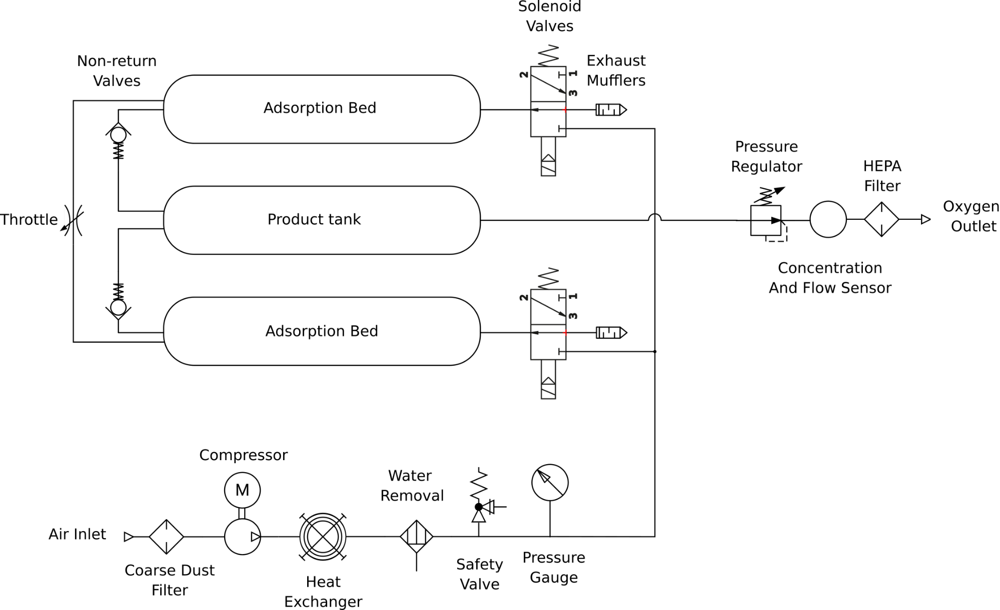
-----------------------

During building there are several critical elements, which should be chosen carefully:

-   Compressor
-   Zeolite for adsorption beds
-   Solenoid valves
-   Concentration and flow sensor

Air compressor
--------------

It is critical to avoid any oil contaminations in an oxygen-rich environment, that’s why you should use an oil-free compressor. The original design is based on the compressor with such characteristics:

|                        |          |
|------------------------|----------|
|Power Consumption       |540 W     |
|Max Working pressure    |8 bar     |
|Productivity            |126 LPM   |
|Supply voltage          |220 V     |

You can vary the design and use of another compressor. Be careful in your choice, too powerful compressor could lead to overheating of the heat exchanger and zeolite(and damage its structure!).

Moisture removal
----------------

An important stage in the PSA system is the removal of moisture from the compressed air. Zeolites are highly sensitive to any moisture, and water removal stage is necessary just after cooling stage. It looks like it is not enough to use convenient pneumatic water separator. If moisture levels are too high, zeolite or CMS become saturated with water vapor. Types of moisture adsorbents include activated alumina, silica gel and molecular sieve.

We have failed several times, “killing” zeolite during long-term test of our design, when it was operated without precise water-removal stage. That is why we have added several water removal stages. First one is just after pneumatic water removal. It is conventional water filter capsule, filled with silicagel.

The second stage is inside adsorption beds.

Zeolite
-------

Zeolite is another critical part of the design. Depending on the quality of zeolite, you can get different concentrations and flow of oxygen. Here we have summarized zeolite manufacturers, you can try different ones.

Basically, there are two major types of zeolites, used in oxygen concentrators: 13X and LiX. 13X are cheaper ones. LiX is more expensive and is more productive. Current design use 13X sieves, for other types maybe you should correct zeolite bed length and compressor performance.

Table 2. Zeolites, available on the market[2].

|Manufacturer      |Name               |Type         |Comment |
|------------------|-------------------|-------------|--------|
|UOP(Honeywell)    |OXYSIV MDX         |LiX    |Provides efficient performance for stationary and transportable concentrators|
|UOP(Honeywell)    |OXYSIV 5XP         |13X    |Molecular sieve with high N2 removal capacity and selectivity. Optimizes performance for all concentrators, including portables.|
|Arkema(Ceca)      |NITROXY 5          |LiX    ||
|Arkema(Ceca)      |NITROXY Revolution |LiX    ||
|Arkema(Ceca)      |NITROXY SXSDM      |LiX    ||
|Jalon             |JALOX- 501         |13X    ||
|Jalon             |JALOX-101          |LiX    ||
|Zeochem           |ZEOX OII           |13X    ||
|Zeochem           |ZEOX Z12-07        |LiX    ||
|Zeochem           |ZEOX OP-32         |LiX    ||
|Zeochem           |ZEOX Z12-49        |LiX    ||
|Zeochem           |ZEOX OP-92         |LiX    ||

Adsorption Beds
---------------

These elements are “lungs” of the oxygen concentrator. Their size and capacity are very important. They should be optimized relative to several factors:

-   Zeolite type
-   Zeolite particle size
-   Flow rate

Our design was empirically optimized to 13X zeolite with particle size 0.4-0.8 mm. For your case, you can try different lengths of aluminium tubes.

Also, after long experiments with 13X zeolite, we have found that it can be easily “killed” with any moisture. That is why we have added two additional cap layers of silica gel.

Oxygen concentration and flow measurement
---------------------------------------------------------------

There are two types of oxygen concentration measurements, usually used in medical applications: electrochemical cell and ultrasonic sensor.

An electro-galvanic oxygen sensor is a fuel cell based on the oxidation of lead that produces an electrical output proportional to the oxygen level inside the sensor. Its main drawback is that it consumes itself over several months as it is exposed to oxygen.

Because electro galvanic sensors are relatively low-cost and dependable devices that can measure 0-100% oxygen levels, they are used as medical oxygen sensors in many hospital ventilators as well as SCUBA diving equipment. The downside of electro galvanic oxygen sensors like medical oxygen cells is that they typically have a lifespan measured in months[1].

Electrochemical sensors have good linearity and precision. OpenOx motherboard has a connector, suitable with most medical oxygen sensors:

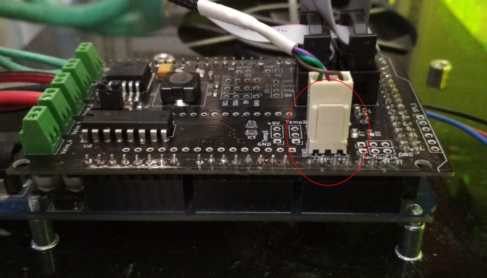

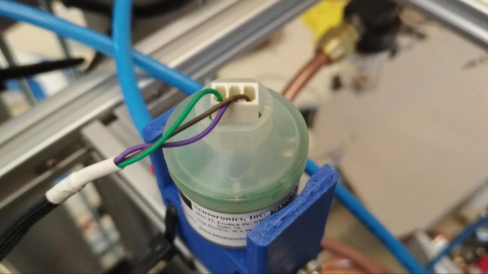

Another type of oxygen concentration measurement is ultrasonic. Ultrasonic oxygen sensors use sound speed to measure the amount of oxygen in a gas or liquid sample. In liquid, upstream and downstream sensors measure the velocity difference between high-frequency sound waves. The change in velocity is proportional to the amount of oxygen in the sample. In gases, the sound speed varies as the molecular composition of the gas varies. This makes ultrasonic oxygen sensors useful for anaesthesia ventilators or oxygen generators where the output is a known concentration of oxygen gas. Typical applications that require ultrasonic oxygen sensing methods are hospitals, gas analysis, or applications involving oxygen concentrators or portable oxygen generators. One of the main advantages of this sensor, that is also can measure gas flow, replacing mechanical flow meters and reducing cost. OpenOx has its own ultrasonic concentration sensor design, but currently, it is on the WIP stage. Therefore, an only the electrochemical sensor is supported for now.

Solenoid valves
---------------

Reliable switching of flow for this pneumatic circuit is very important, but keeping the cost of the device low is also critical. OpenOx design includes a standard pneumatic indirect electromagnetic valve. Indirect acting solenoid valves use the pressure energy of the operating fluid to open and close the valve seat and therefore need a pressure differential to operate (minimum 0.1bar). The pilot system functions like a booster so that even with a solenoid of lesser magnetic force (than that of a directly actuated valve), fluids flowing at higher rates under high pressures can be controlled. Both pistons and diaphragms are used as sealing elements for the main seat. Media pressure assists valve opening allowing for a smaller coil and less power consumption in the result.

Building necessary elements
===========================

Spiral heat exchanger
---------------------

Heat exchanger cools down air, which comes from the compressor. Cooling is necessary because zeolite does not work well at high temperatures. Also, the water removal stage requires cooling.

Heat exchanger made of copper tube, used in air conditioner systems. To bend this tube fill it with clean sand. You can find numerous videos on youtube with this process!

Adsorption bed caps
-------------------

We have designed two types of adsorption bed caps: CNC milled from aluminium or 3 printed with PETG plastic. You can choose any of them. Fully metal caps are more reliable, but it actually matters of taste:) For sealing, we use 3d printed sealing rings. Material: TPU

HEPA Filter
-----------

The HEPA filter is used to clean oxygen from any contaminations. We use a HEPA filter for vacuum cleaners. Since all models have different sizes, the HEPA filter holder model is fully parametric, you can set parameters, suitable for your one.

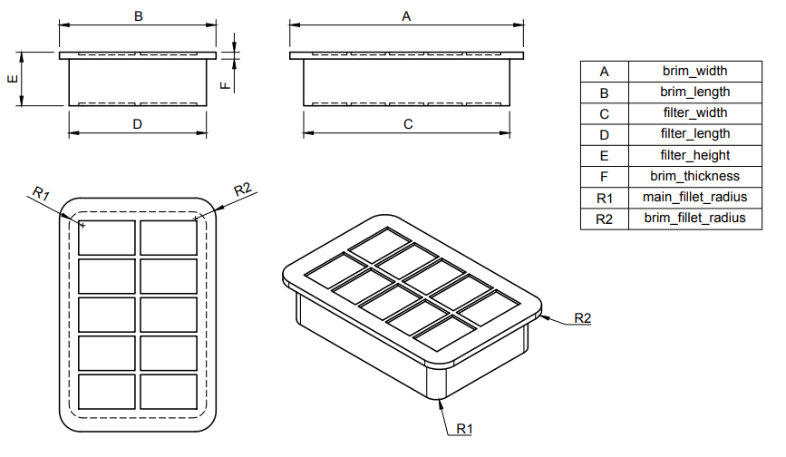

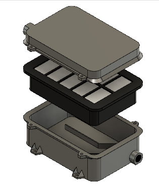

Assembly process
================

We do not try to describe all the steps, we describe only the most important ones instead. If you have some problems with the assembly process, please contact us for more detailed instructions.

Step 1. Frame assembly
----------------------

Frame is fully assembled with a strut aluminum profile with size 2020, and actually there are no special tricks in its assembly. Just use standard fastening tools and fit design to your needs and available resources. Several images of connections will be listed below. Refer to BOM for detailed dimensions of frame elements.

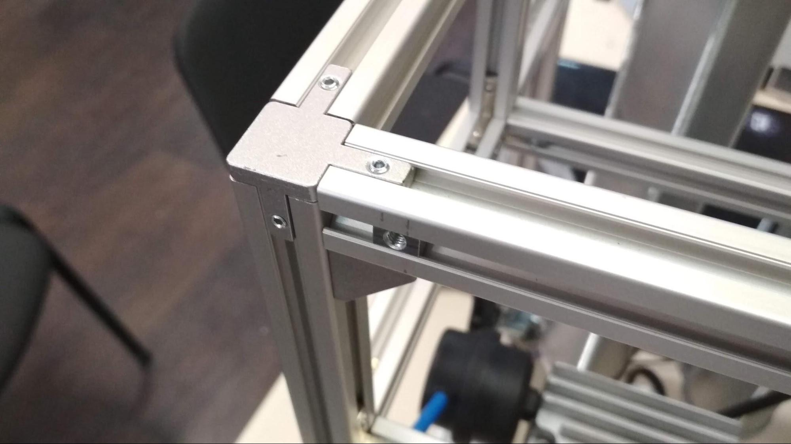

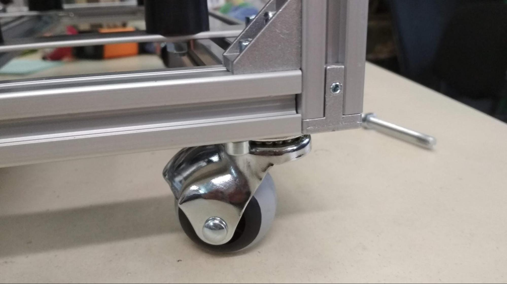

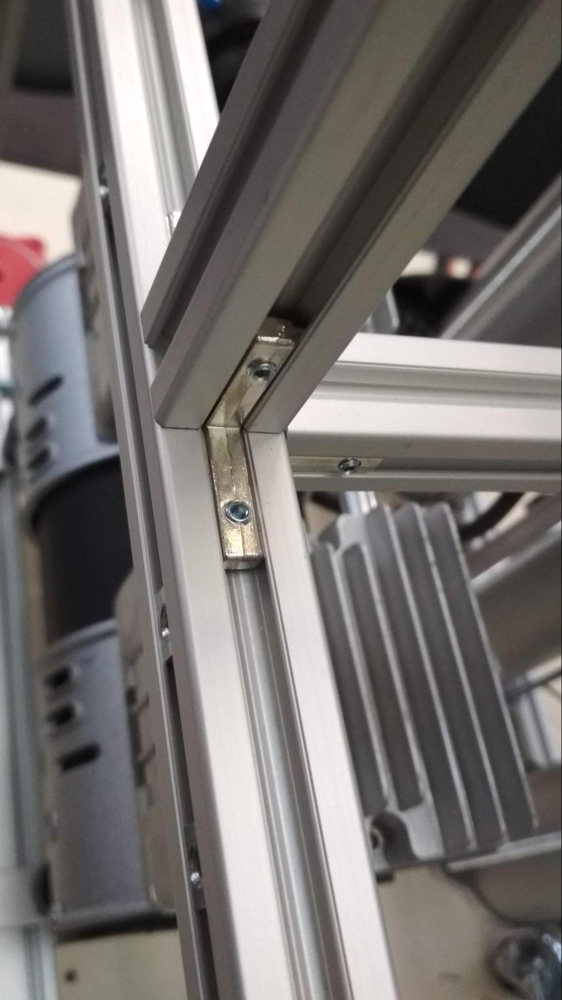

Step 2. Adsorption beds
-----------------------

Parts, needed for assembly

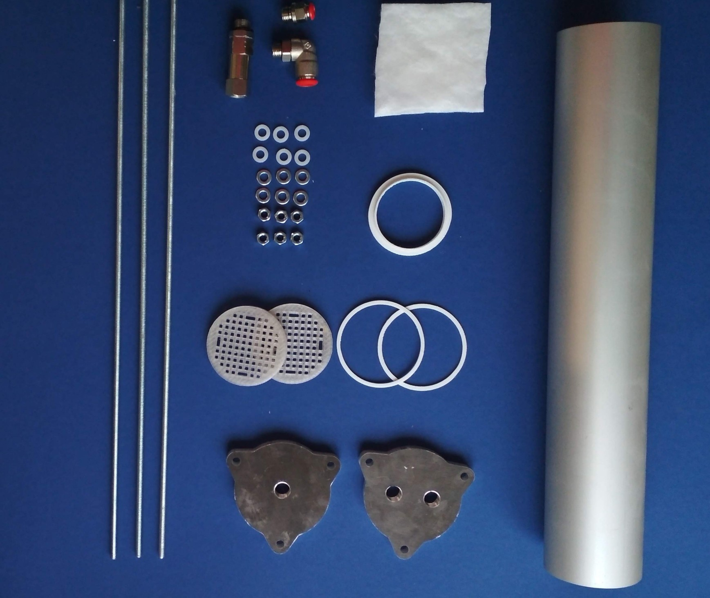

1.  Threaded rod M6 - 3 pcs
2.  Nuts, steel and plastic washers M6 - 6 pcs
3.  Filters - 2 pcs
4.  Sealing rings. Should be printed with elastic material- 2 pcs
5.  Compression ring. Should be printed with elastic material - 1 pcs
6.  Filter cloth - 2 pcs.
7.  1/4" 10mm L-Shaped threaded connector - 1 pcs
8.  1/4" 10mm check valve - 1 pcs
9.  1/4" 6mm L-Shaped threaded connector
10. CNC milled or 3d printed caps. Caps have G1/4” thread.
11. 70 mm diameter aluminum tube, 3 mm wall thickness. 400 mm length
12. 200 g of silica gel
13. 700 g of 13X zeolite

Wrap filter with filter cloth. Install it at the end of the tube. Remove excess cloth material with a scalpel.

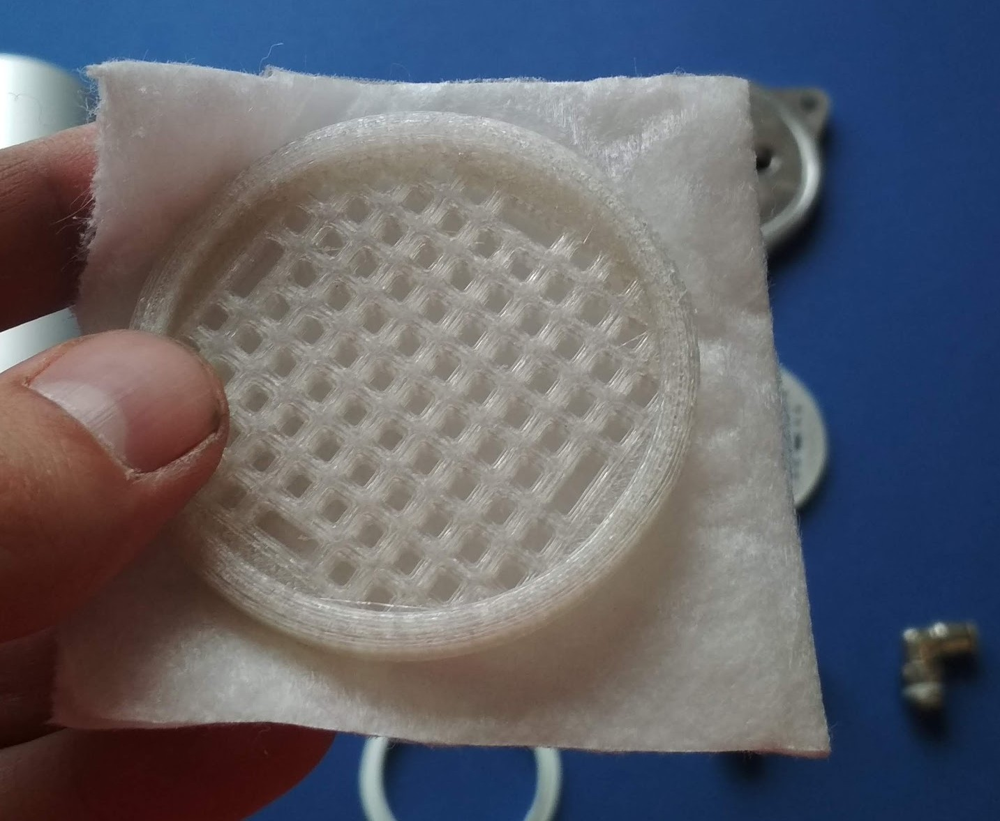

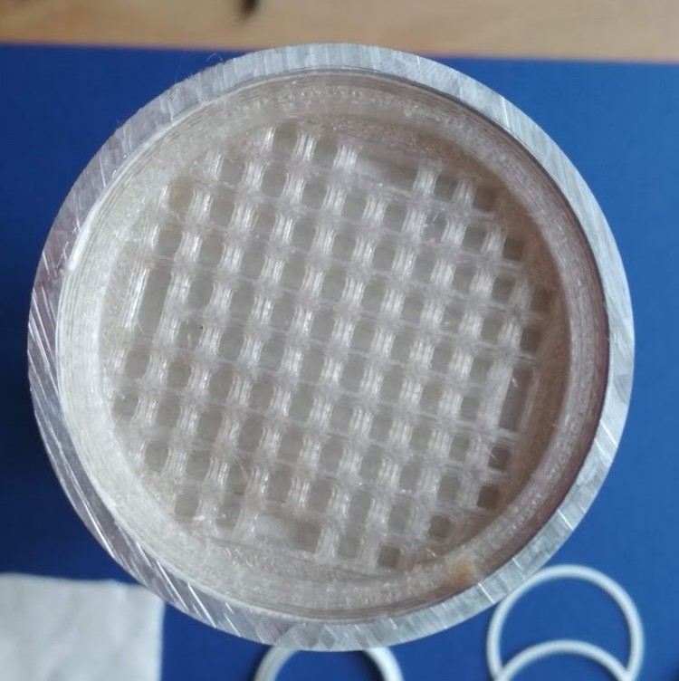

Fill tube with 100 g of silicagel from the one end, then 700 g of zeolite, and then 100 g of silicagel again.

Install a second filter from the other end. Add a compression ring.

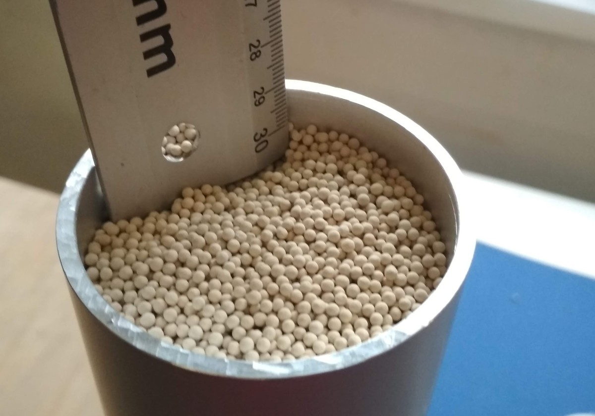

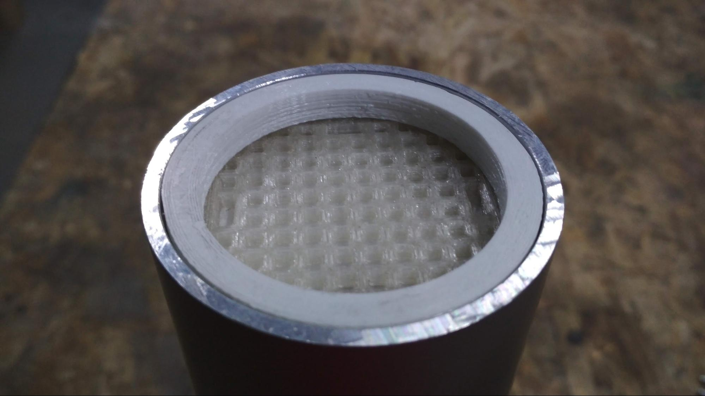

Install sealing rings in caps. Use threaded rods to finish the assembly. Note that zeolite should be compressed inside a bed.

Step 3. Oxygen tank
-------------------

Assembly of oxygen tank is similar to adsorption beds. The only difference is that you do not need filters and compression rings.

Step 4. Install beds and tank into the frame.
---------------------------------------------

Install sieve beds and oxygen tank into the frame using 3d printed holders:

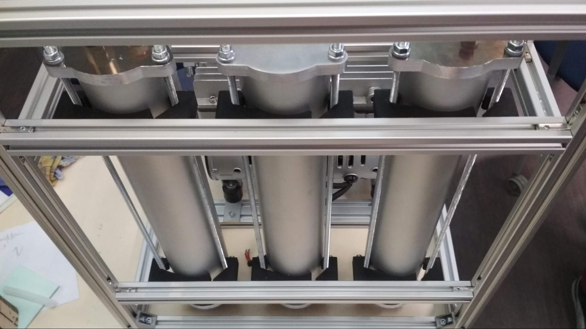

Step 5. Motherboard soldering and installation
----------------------------------------------

Motherboard and firmware are hosted on github with building instructions. Please refer there:

[https://github.com/hacklabkyiv/openox-fw](https://www.google.com/url?q=https://github.com/hacklabkyiv/openox-fw&sa=D&ust=1592736353547000) - firmware

[https://github.com/hacklabkyiv/openox-pcb](https://www.google.com/url?q=https://github.com/hacklabkyiv/openox-pcb&sa=D&ust=1592736353547000) - PCB

Step 6. Wiring
--------------

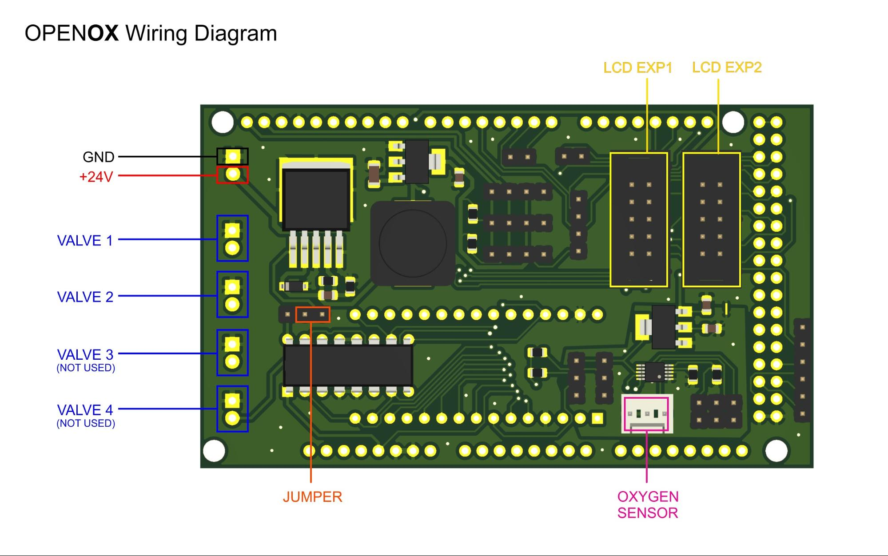

Tuning process
==============

After the assembly of your concentrator it is necessary to tune it properly, to achieve best performance. Concentrator is very sensitive to tuning parameters, so be prepared to spend a lot of time, to get right ones. There are two parameters you need to tune: throttle position and switching period. These parameters depends on compressor power, type of zeolite, size of zeolite particles etc. As starting point set switching period to 7000 ms and throttle position as fully closed. Also, we recommend to install some kind of dial and handle on the throttle regulator to precise control its change:

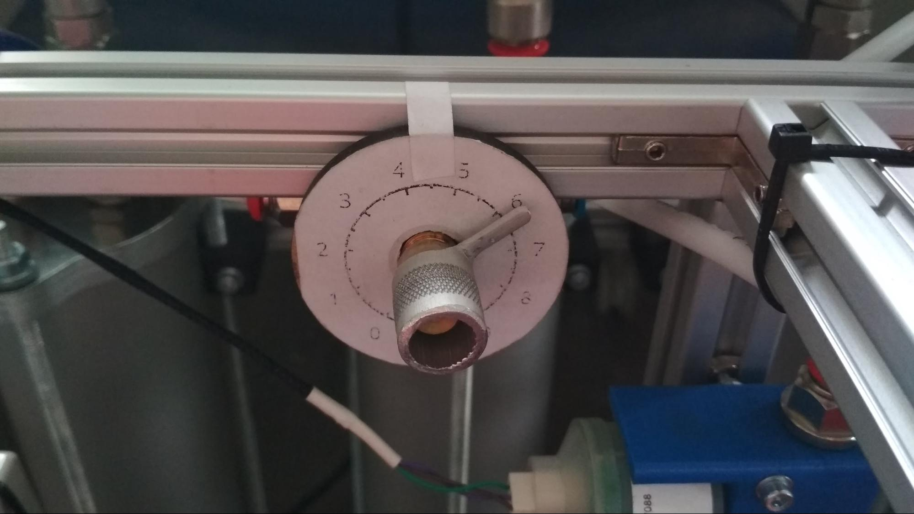 

Then steps are the following:

1.  Check oxygen concentration measurement: it should show 21% in air. If not - use an adjustment screen on the input controller to setup.
2.  Setup output flow to 1 LPM using a flow meter.
3.  Enable compressor
4.  Wait 5 minutes to stabilize the oxygen level
5.  Write down the oxygen level and change throttle position a bit.
6.  Repeat steps 4 and 5 until you will get maximum.

Do the same for other switching periods, usually change is about 200-300 ms per measurement.

Further improvement
===================

Our design can be significantly improved. We see several directions for improvement.

1.  Pressure equalization steps between adsorption beds switching. This will reduce power consumption, noise level and decrease stress in adsorption beds.
2.  Multi-bed PSA. multi-bed PSA process was developed for continuous operation and delivery of high flow rates of the product gases.

Also, if you are an expert in PSA field, feel free to commend and improve this documentation, to make it better by sharing your knowledge!

References
==========

1.  Gaslab.com. 2020. How Does An Oxygen Sensor Work?. [online] Available at: https://gaslab.com/blogs/articles/how-does-an-oxygen-sensor-work [Accessed 28 May 2020].
2.  Ackley, M. W. (2019). Medical oxygen concentrators: a review of progress in air separation technology. Adsorption, 25(8), 1437–1474. doi: 10.1007/s10450-019-00155-w
3.  https://core.ac.uk/download/pdf/48655747.pdf

