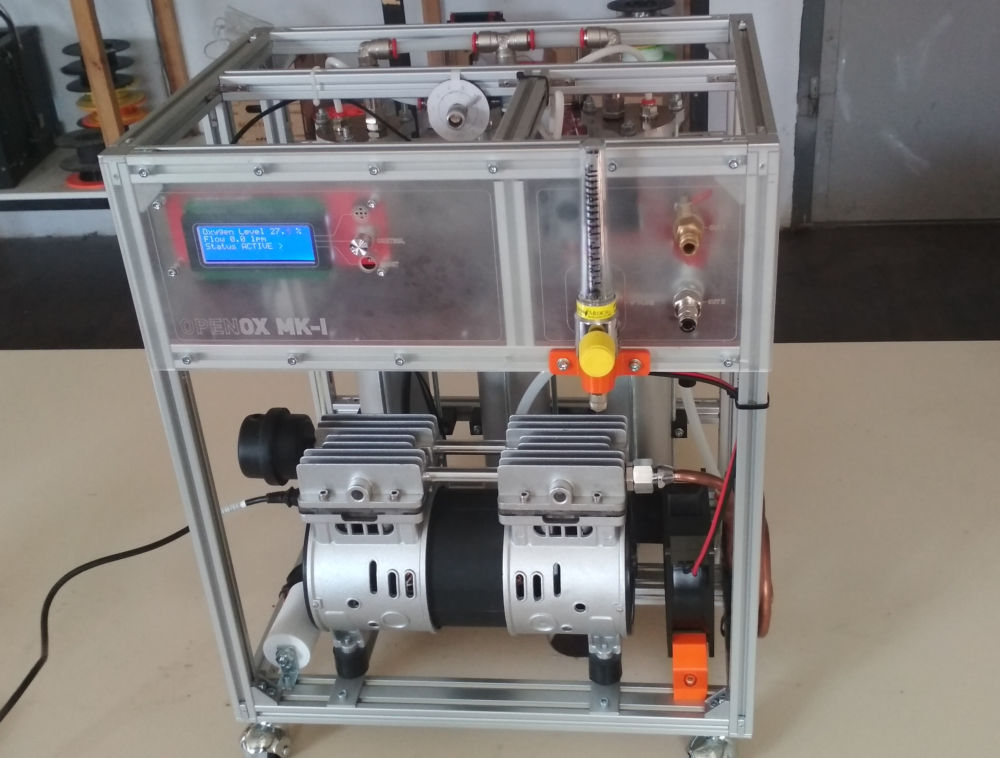

# OpenOX MKI: OSHW Oxygen Concentrator

**OpenOx** is a project of open-source hardware oxygen concentrator. It has a simple design and is optimized for fast production. The oxygen concentration level of the output gas ranges from 85% to 95%. Flow from 1 to 6 LPM. The oxygen is delivered to the patient through the use of a nasal cannula. The OpenOx concentrator uses a molecular sieve and pressure swing adsorption methodology to produce the oxygen gas output. Ambient air enters the device, is filtered and then compressed. This compressed air is then directed toward one of two nitrogen adsorbing sieve beds. Concentrated oxygen exits the opposite end of the active sieve bed and is directed into an oxygen reservoir where it is delivered to the patient.

### Technical Specification

OpenOx has flexible and modular design, therefore techical specification can vary depending on choosen components. In basic configuration they are:

| Property            | Value            |
| --------------------| ---------------- |
| Max oxygen flow     | 6 LPM            |
| Oxygen concentration| 85-95 %          |
| Power consumption   | 580 W            |
| Dimensions          | 550mmx400mmx300mm|
| Weight              | 20 kg            |

### Documentation and building instructions

Currently, building instructions are placed on Google drive, please check out this link
[documentation](https://docs.google.com/document/d/1ixzttdHdoLdcEha1TVJCyJB47DOLL0A6jboofB66MYc/edit?usp=sharing). We are in progress of moving it here. You can always help us to polish the documentation, feel free to join.

* General information and building instructions: [link](https://docs.google.com/document/d/1ixzttdHdoLdcEha1TVJCyJB47DOLL0A6jboofB66MYc/edit?usp=sharing)
* Autodesk Fusion 360 project: https://a360.co/2zARV0g
* BOM: [link](https://docs.google.com/spreadsheets/d/10ZUSy3DPvSKDeT9YbCROi2vXnXLKsUdeljT3vWMD914/edit?usp=sharing)
* Motherboard(Arduino Mega shield): https://github.com/hacklabkyiv/openox-pcb
* Firmware: https://github.com/hacklabkyiv/openox-fw
* Ultrasonic oxygen concentration sensor PCB(WIP): https://github.com/hacklabkyiv/ultrasonic-oxygen-sensor-pcb
* Ultrasonic oxygen concentration sensor firmware(WIP): https://github.com/hacklabkyiv/ultrasonic-oxygen-sensor-pcb

### Support or Contact

If you have any questions, as us directly, via e-mail info@hacklab.kiev.ua. We are always looking for volunteers to:
* Build your design and share changes, to make OpenOx better
* Improve documentation

Check out our [issues list](https://github.com/hacklabkyiv/openox/issues).
